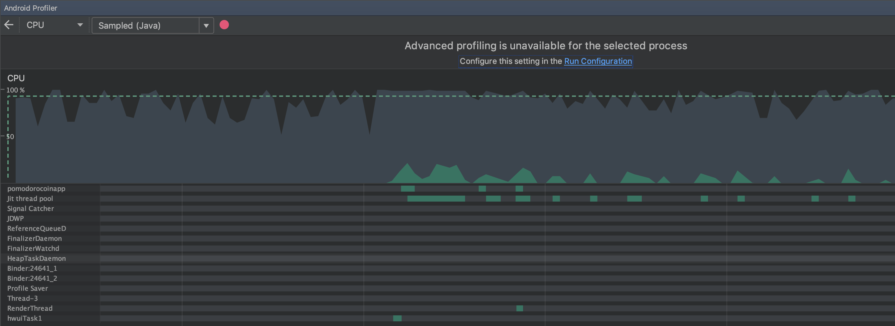
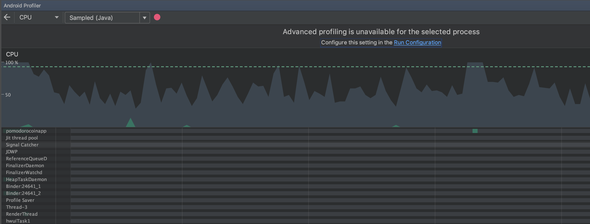

# Análise CPU

O aplicativo faz uso da CPU enquanto roda o timer, podemos ver um claro uso toda vez que a tela é atuliazada(à cada segundo).

### App Ativo

### App em Background

## Estratégias para melhorar desempenho

Como a maior parte do gasto da CPU ,no estado em que o desenvolvimento do app se encontra, é na atualização do timer a cada segundo, uma otimização a ser feita é interromper a operação de atualizar o timer na UI quando o aplicativo estiver em idle, continuando a decrescer o relógio e voltar a atualizar assim que o usuário colocar a aplicação no Foreground(ativa).

No estado atual nenhuma tarefa é feita em uma thread separada.

Uma tela(Tasks) que não foi implementada fará uso de RecycleView e seu conteúdo será carregado com AsyncTasks.

O App teve algumas limitações de uso de features que as bibliotecas mais novas provem devido a minSDK ser a 15, pois eu testava na maioria das vezes com um emulador nessa versão.

