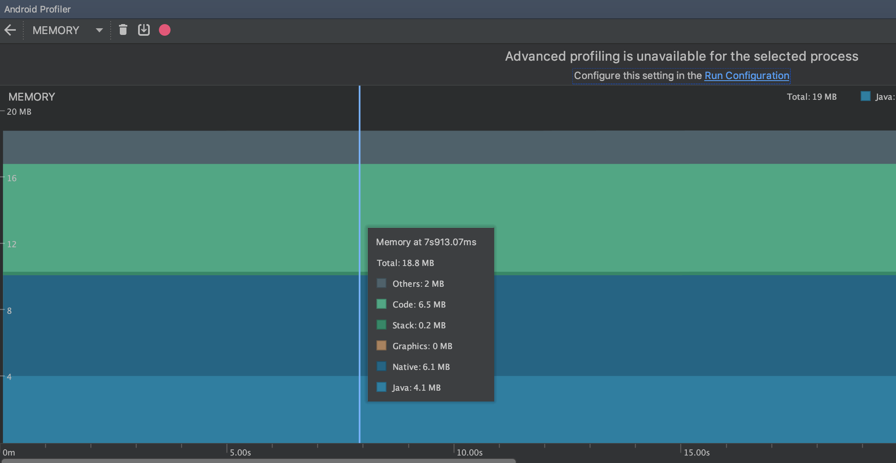
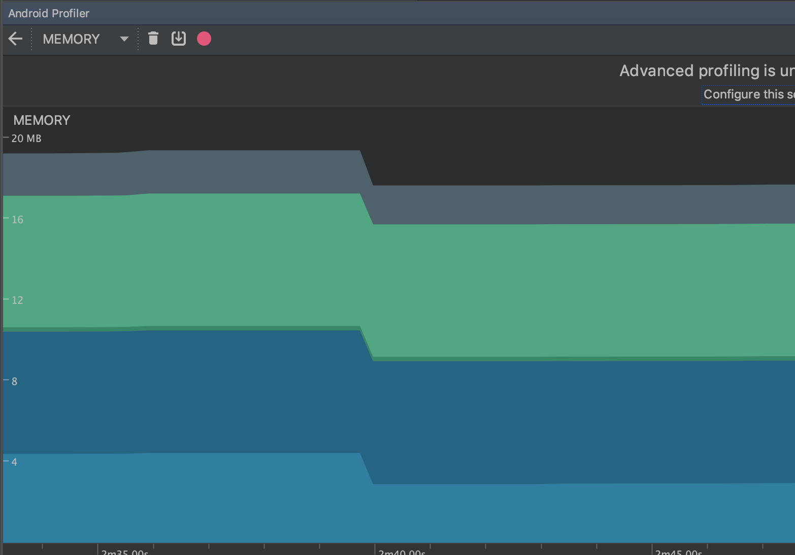

# Análise de Memória

O aplicativo não demonstrou nenhuma anormalidade quanto ao uso de memória. Levando em conta também que a memória é extremamente limitada pois o teste foi efetuado usando um emulador.

## App Ativo

## App em Background

É notável a diferença quando colocamos o app em Idle

## Ferramentas de Análise

Foi utilizada a ferramenta LeakCanary para testar a memória, identificando memory leaks. O App foi usado exaustivamente e não foi relatado nenhum memory leak.

